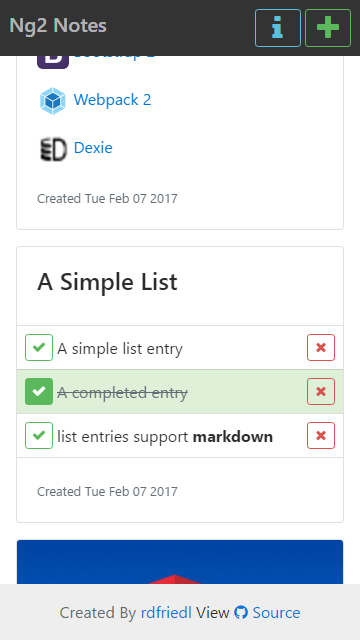
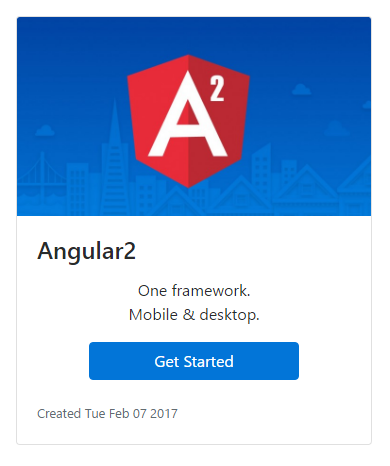
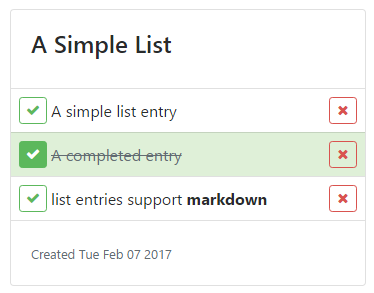
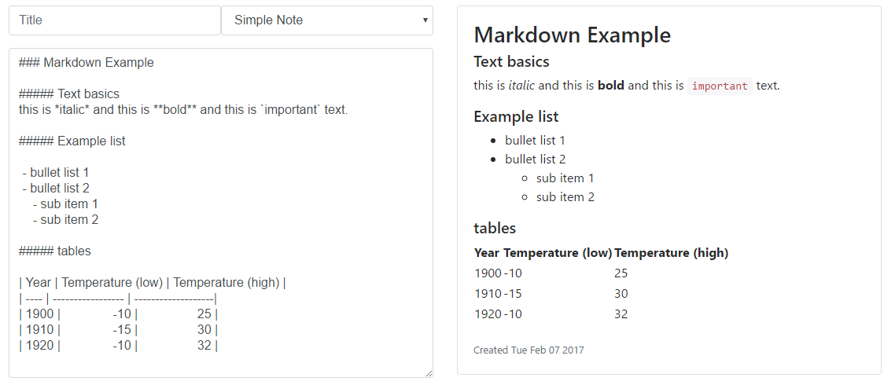

# Ng2-notes
A simple demo project built by [rdfriedl](http://rdfriedl.com) with [angular2](https://angular.io)

[**Demo**](http://notes.rdfriedl.com)
[**Github**](https://github.com/rdfriedl/ng2-notes)

## Libraries Used

<a href="https://angular.io" target="_blank">Angular 2</a>

<a href="https://v4-alpha.getbootstrap.com" target="_blank">Bootstrap 2</a>

<a href="https://webpack.js.org/" target="_blank">Webpack 2</a>

<a href="http://dexie.org/" target="_blank">Dexie</a>

## Features

##### Mobile First design

##### Image Notes

##### List Notes

##### Markdown Support

